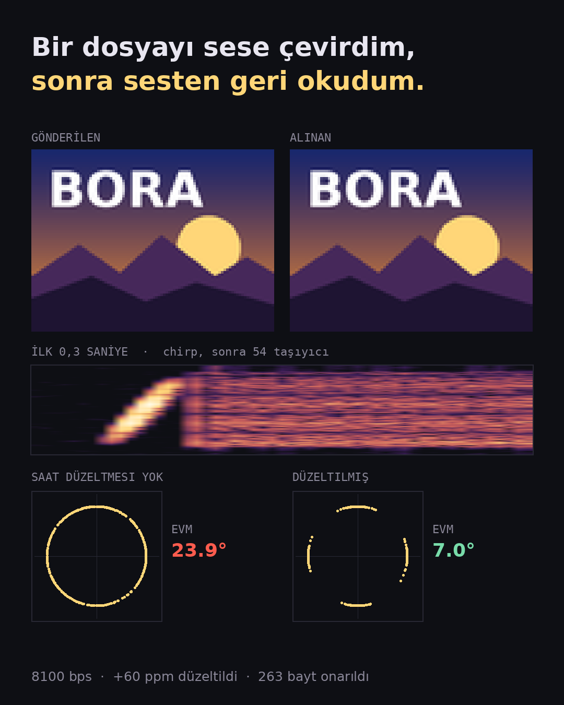
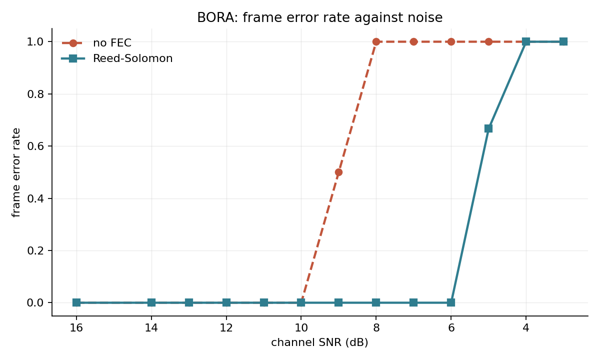
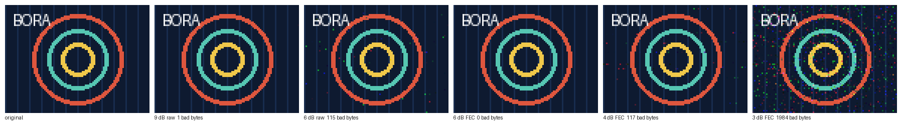

# BORA

**Byte Over Resonant Air** — an acoustic modem in pure Python. It turns a file
into sound, plays it across a room, and turns it back into the same file. No
radio, no network, no pairing. A speaker at one end, a microphone at the
other.

```python
import bora

wave = bora.transmit(b"hello over the air")
bora.receive(wave).payload
# b'hello over the air'
```

```
pip install git+https://github.com/fatihsahinbas/BORA
```

Not on PyPI yet; the line above installs straight from this repository.



A 96×72 bitmap through a simulated room: echoes, transducer roll-off,
20 dB noise, two interference bursts and a 60 ppm clock mismatch. The closing
chirp measured the drift at +60.2 ppm, Reed-Solomon repaired 263 bytes that
arrived wrong, and the CRC confirmed the result. Decoded without the drift
correction, the same recording loses all 93 blocks. The two constellations
show why: without correction the phase smears around the whole circle;
with it, four tight arcs. Reproduce it with
`python examples/video_demo.py --out-dir docs/`.

---

## What it does

| | |
|---|---|
| Raw channel rate | 8100 bps |
| Goodput with parity | ~7000 bps |
| Band | 1–6 kHz |
| Works down to | 6 dB SNR with error correction, 10 dB without |
| Clock tolerance | ±400 ppm, measured and corrected automatically |
| Echo tolerance | 2.7 ms in the cyclic prefix, longer echoes absorbed by parity |
| Dependencies | numpy, reedsolo |

A 20 KB bitmap takes about 24 seconds of airtime. Encoding costs ~120 ms,
decoding ~680 ms — roughly 35× faster than real time in NumPy alone.

---

## The picture that explains it



Two cliffs, four decibels apart. The left one is the modem without parity; the
right one is the same modem with Reed-Solomon. The gap is what the error
correction buys, paid for in airtime.

The same story in pixels — a raw bitmap sent at decreasing signal levels:



At 6 dB the uncoded transmission is speckled and the coded one is bit-perfect.
At 3 dB the code finally gives up, and it gives up gracefully.

---

## Try it

```bash
bora info                              # physical layer parameters
bora send photo.jpg -o out.wav         # file to sound
bora recv out.wav -o recovered.jpg     # sound to file

bora loopback --size 4000 --snr 8      # through simulated noise
bora loopback --size 4000 --snr 20 --realistic   # echoes, drift, cheap speakers
bora sweep --out ber.csv               # measure the curve yourself
```

With `sounddevice` installed
(`pip install 'bora-modem[audio] @ git+https://github.com/fatihsahinbas/BORA'`)
it leaves the computer:

```bash
bora play out.wav                      # on one machine
bora listen --seconds 30 --payload recovered.jpg   # on another
```

---

## How it works

**OFDM.** 54 carriers spaced 93.75 Hz apart across the 1–6 kHz band, each
carrying 2 bits per symbol, 75 symbols per second. One inverse FFT builds a
symbol; one forward FFT takes it apart.

**Differential QPSK.** Each carrier's phase is compared against *the same
carrier in the previous symbol*, so the receiver never needs to know what the
room did to the absolute phase. It costs about 3 dB against coherent
detection, and it removes the channel estimator, the pilot tones and the
equaliser entirely. That is the right trade for a first working link.

**A cyclic prefix** copies the tail of each symbol onto its front. An echo
arriving inside that window lands on a copy of the signal rather than on the
previous symbol, which turns multipath from intersymbol interference into a
per-carrier phase rotation — and differential detection cancels that for free.
This is the one idea that makes sending data through a room possible at all.

**Chirp markers.** The frame opens with a sweep from 1 to 6 kHz and closes
with one going the other way. A chirp's autocorrelation is a single sharp
spike, so one matched filter gives sample-accurate timing with no search.

**Reed-Solomon over GF(256)**, 255-byte codewords with 32 parity bytes,
correcting 16 byte errors each — *plus a block interleaver*, which matters
more than the code. Acoustic errors arrive in clusters: a notch in the room
response kills the same carriers in every symbol, a chair scrape wipes out
several symbols in a row. Codewords are transmitted column-wise, so bytes that
travel next to each other belong to different codewords. A burst that would
have destroyed one codeword instead scratches many, and each scratch is well
inside what the code repairs.

**A CRC that is not part of the error correction.** Reed-Solomon tells you
whether it could repair what it saw. The CRC tells you whether the result is
actually the message that was sent. Those are different questions, and a
miscorrecting codeword answers the first one wrongly.

---

## The part that was actually hard

Everything above works perfectly through a WAV file and fails between two
laptops. The reason is that two machines nominally sampling at 48 kHz do not.
They differ by tens to hundreds of parts per million, and the error
accumulates: at 100 ppm a ten-second transmission ends a millisecond out of
step, the FFT window slides off the symbol boundary, and the constellation
smears until the decisions fail.

Here is that failure, isolated. Each impairment alone is survivable; the
combination is not:

```
clean                              EVM  0.0°   OK
multipath only                     EVM  5.7°   OK
transducer response only           EVM  0.9°   OK
noise at 20 dB only                EVM  2.8°   OK
clock drift 60 ppm only            EVM  8.1°   OK
all together                       EVM 11.3°   FAILED: 8/18 blocks beyond repair
```

The first thing I tried was lengthening the cyclic prefix, on the theory that
the echoes were the problem. It bought nothing — the error stayed flat at 11°
across every prefix length from 2.7 to 8 ms, which is what told me I was
looking at the wrong impairment.

The fix is the closing chirp. The header decodes reliably because it is only
four symbols long and the drift has had no time to accumulate; the header
gives the payload length; the length gives the exact sample position the
closing chirp *should* occupy. Comparing that with where it actually is
measures the clock error directly:

    ppm = (nominal_distance / measured_distance - 1) × 1e6

No tracking loop, no phase-locked loop, no per-symbol correction. One
correlation, one division, one resample. Measured accuracy is within 3 ppm,
and the link then tolerates at least ±400 ppm:

```
 injected   measured   EVM    result
        0        0.0   7.3°   OK
       10        9.0   7.4°   OK
       60       62.7   7.3°   OK
      150      147.8   7.4°   OK
      400      403.1   7.3°   OK
     -200     -197.0   7.3°   OK
```

---

## Why not Rust

The obvious objection to a Python modem is speed, so I measured before
optimising. The demodulator runs about 35× faster than real time — and
real-time audio needs exactly 1×.

The reason is that the expensive part is not in Python at all. OFDM's hot loop
*is* the FFT, and NumPy's FFT is compiled. The Python code above it just
arranges arrays. Python is slow at per-sample feedback loops, and this design
deliberately has none: differential detection replaces the equaliser, and the
two-chirp measurement replaces the timing recovery loop.

Rust becomes worth it when a per-sample loop appears that cannot be
vectorised — an adaptive equaliser, or coherent detection with a phase-locked
loop. That is a real possibility for version 2. It is not a reason to start
there.

---

## Layout

```
src/bora/
  config.py     physical layer parameters; everything derives from here
  modem.py      OFDM, differential QPSK, chirp synchronisation
  fec.py        Reed-Solomon and the block interleaver
  framing.py    wire format: magic, length, CRC
  link.py       the two functions users call
  channel.py    simulated impairments, so the hard parts are debuggable offline
  audio.py      WAV files, and live playback when PortAudio is present
  cli.py        command line
```

The channel module earns its place: echoes, transducer roll-off, clock drift
and interference bursts are all reproducible from a seed, which means a
failure that took a room to produce can be debugged on a laptop with the sound
off.

[`SPEC.md`](SPEC.md) documents the wire format completely enough to write an
independent implementation.

### Examples

```
examples/
  image_demo.py     a bitmap at falling signal levels, with and without parity
  video_demo.py     one transmission as a video and a cover image (pillow, ffmpeg)
  sstv_demo/        a single-tone FM modem in the style of SSTV, for comparison
```

---

## Status

Version 0.1. Works reliably through files and through the simulated room
model. Live speaker-to-microphone transmission works but has not been tested
across a wide range of hardware; that is the next milestone, along with
coherent detection with pilot carriers to recover the 3 dB that differential
encoding gives away.

Tests: `pip install -e '.[dev]' && pytest`

MIT licensed.
